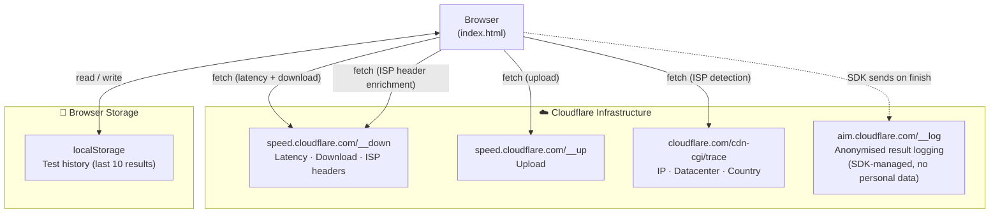

# SpeedProbe

> Crystal-clear, real-time internet speed & diagnostics — right in your browser.

**[→ Live demo](https://iakshayubale.github.io/speedprobe/)**


SpeedProbe is a free, privacy-respecting internet speed test with a deliberately
beautiful interface. It measures download, upload, latency, jitter, bufferbloat,
speed consistency and a full set of deep connection diagnostics — with no ads, no
sign-up and no data ever leaving your browser.

Measurements run against Cloudflare's public speed-test backbone. There is no
server to deploy and no tracking of any kind.

## Features

- **Live gauge & throughput graph** rendered on `<canvas>` in real time.
- **Core metrics** — download, upload, ping and jitter.
- **Deep diagnostics** — bufferbloat, speed consistency, DNS / TCP / TLS / TTFB
  timing and a connection fingerprint.
- **Use-case readiness** — at-a-glance verdicts for video calls, 4K streaming,
  gaming, large downloads and more.
- **Local history** — your last results are kept in `localStorage`; nothing is
  uploaded.
- **Zero build step** — pure HTML, CSS and ES Modules. No framework, no bundler.
- **Privacy first** — no ads, no analytics, no accounts.

## Quick start

SpeedProbe uses native ES Modules, so it must be served over HTTP — opening
`index.html` directly from the file system (`file://`) will be blocked by the
browser. Start any static server from the project root:

```bash
# Python 3 (already on most machines)
python3 -m http.server 8848

# …or Node
npx serve .
```

Then open <http://localhost:8848> in your browser and press **START**.

If you have Node installed, the bundled npm script does the same thing:

```bash
npm start
```

## Tech stack

- **HTML5** + semantic markup
- **CSS3** — custom properties, glassmorphism, `<canvas>`-driven visuals
- **Vanilla JavaScript (ES Modules)** — no dependencies, no build tooling
- **Cloudflare speed-test endpoints** for measurement traffic

## Architecture

The application is split into small, single-responsibility ES Modules under
`assets/js/`. `app.js` is the entry point and the only file referenced by
`index.html`.

For the full reference — module dependency graph, test execution sequence,
ISP detection flow and data-privacy table — see
[architecture/ARCHITECTURE.md](architecture/ARCHITECTURE.md).

### How it fits together



### Module responsibilities

| Module            | Responsibility                                                        |
| ----------------- | --------------------------------------------------------------------- |
| `app.js`          | Entry point — bootstraps the app, orchestrates a test, wires events.  |
| `config.js`       | Frozen configuration: endpoints, test tuning, colours, storage keys.  |
| `state.js`        | Shared, resettable run state for the single active test.              |
| `measurements.js` | Wraps the Cloudflare SDK — latency, download and upload phases.       |
| `analysis.js`     | Grading, bufferbloat rating, insights and use-case verdicts.          |
| `gauge.js`        | The animated speed gauge (`<canvas>`).                                |
| `graph.js`        | The live throughput / latency graph (`<canvas>`).                     |
| `viz.js`          | Owns the gauge/graph singletons and small UI-state helpers.           |
| `background.js`   | Particle field, custom cursor, scroll progress and reveal effects.    |
| `isp.js`          | ISP / IP / location detection via Cloudflare-only endpoints.          |
| `history.js`      | Persisting and rendering past results from `localStorage`.            |
| `share.js`        | Web Share API with a clipboard fallback.                              |
| `dom.js`          | Tiny DOM helpers (`byId`, `setText`, …).                              |
| `utils.js`        | Pure helpers: stats, formatting and a small polyfill.                 |
| `vendor/speedtest.js` | `@cloudflare/speedtest` v1.10.1 — MIT © 2023 Cloudflare.         |

Styles live in `assets/css/styles.css`. Fonts are self-hosted in `assets/fonts/` (no CDN calls).

## Contributing

Contributions are very welcome. Please read [CONTRIBUTING.md](CONTRIBUTING.md)
and our [Code of Conduct](CODE_OF_CONDUCT.md) before opening a pull request.

## License

Released under the [MIT License](LICENSE).

## Acknowledgements

Measurement traffic is served by [Cloudflare's public speed test](https://speed.cloudflare.com)
(`speed.cloudflare.com/__down` / `/__up`), which is the same infrastructure used by
[cloudflare.com/speed](https://cloudflare.com/speed) and is openly available for third-party
measurement tools. Cloudflare also aggregates anonymised results to power their
[AIM Internet Quality database](https://blog.cloudflare.com/aim-database-for-internet-quality/).
SpeedProbe is not affiliated with or endorsed by Cloudflare.

Fonts (Sora, JetBrains Mono) are self-hosted from `assets/fonts/` — no request leaves
your domain. Licensed under [SIL Open Font License 1.1](https://openfontlicense.org).
