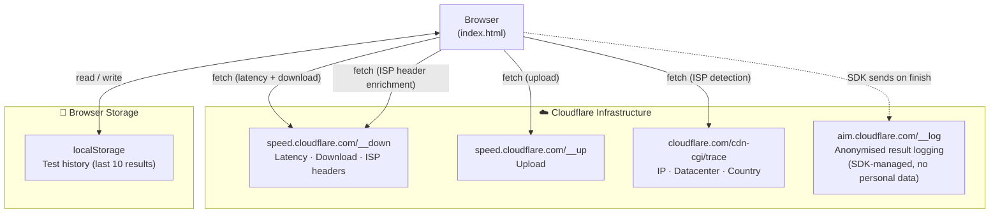
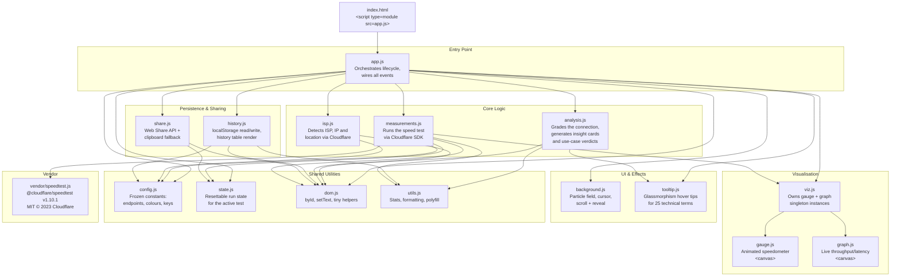
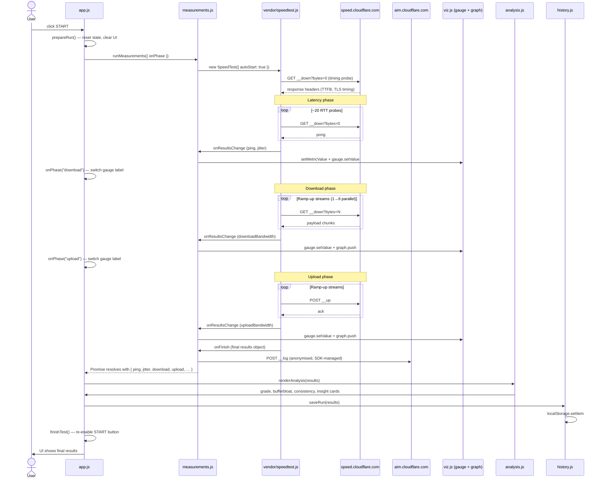
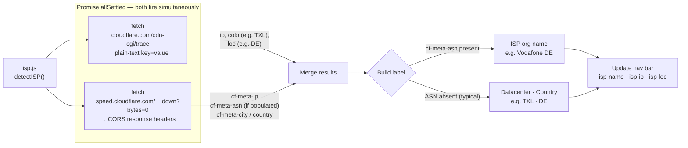

# SpeedProbe — Architecture

A technical reference for how SpeedProbe is structured, how data flows, and how the modules relate to each other.

---

## 1. High-Level Overview

SpeedProbe is a **zero-build, zero-dependency** web application. Everything runs client-side. There is no backend, no server-side rendering and no bundler. The browser loads `index.html`, which boots `assets/js/app.js` as a native ES module, and the app self-assembles from there.

All measurement traffic goes to **Cloudflare's public speed-test infrastructure** only. Two Cloudflare endpoints are also used for ISP / location detection. No third-party analytics or tracking services are contacted.



> The dashed arrow to `aim.cloudflare.com` is managed entirely by the Cloudflare SDK on test completion. It transmits only anonymised speed samples — no IP address, no browser fingerprint and no personal data. See [Cloudflare AIM docs](https://developers.cloudflare.com/fundamentals/speed/aim/).

---

## 2. Module Map



---

## 3. Test Execution Sequence

This diagram traces a single run from the user pressing **START** to the history row being saved.



---

## 4. ISP Detection Flow

ISP / location detection runs once at page load, in parallel with the visual boot sequence. It does not block or delay the speed test.



> Cloudflare exposes `cf-meta-asn` in their CORS `access-control-expose-headers` but does not populate the header value on all PoPs. When absent, the datacenter code + country from `cdn-cgi/trace` serves as the label instead.

---

## 5. File Structure

```
speedtest/
├── index.html                  ← Single HTML shell; all JS loaded as ES modules
├── package.json
├── LICENSE                     ← MIT — SpeedProbe contributors
├── CONTRIBUTING.md
│
├── LICENSES/                   ← Third-party license attributions
│   ├── cloudflare-speedtest-MIT.txt
│   ├── Sora-OFL.txt
│   └── JetBrainsMono-OFL.txt
│
├── architecture/               ← This document
│   └── ARCHITECTURE.md
│
└── assets/
    ├── css/
    │   └── styles.css          ← Design tokens, @font-face, all component styles
    │
    ├── fonts/                  ← Self-hosted Latin woff2 (no CDN calls)
    │   ├── Sora-{200…800}.woff2
    │   └── JetBrainsMono-{300…600}.woff2
    │
    └── js/
        ├── app.js              ← Entry point
        ├── config.js           ← Constants and endpoint URLs
        ├── state.js            ← Mutable run state
        ├── measurements.js     ← Speed-test orchestration (wraps SDK)
        ├── analysis.js         ← Grading, insights, use-case cards
        ├── isp.js              ← ISP / location detection
        ├── viz.js              ← Gauge + graph singletons
        ├── gauge.js            ← Speedometer canvas renderer
        ├── graph.js            ← Throughput/latency canvas renderer
        ├── background.js       ← Particles, cursor, scroll effects
        ├── tooltip.js          ← Hover tooltips for technical terms
        ├── history.js          ← localStorage persistence + table render
        ├── share.js            ← Web Share API + clipboard
        ├── dom.js              ← DOM micro-utilities
        ├── utils.js            ← Pure helpers (stats, formatting)
        └── vendor/
            └── speedtest.js    ← @cloudflare/speedtest v1.10.1 (MIT)
```

---

## 6. Privacy & Data Flow Summary

| Data | Where it stays | Sent externally? |
|---|---|---|
| Raw download/upload/latency samples | Browser memory only | Only anonymised aggregate → `aim.cloudflare.com` (SDK) |
| Test history | `localStorage` on your device | Never |
| Your IP address | Used locally for display only | Never (trace gives it but it stays in JS) |
| ISP / location info | Nav bar display only | Never |
| Fonts | Self-hosted in `assets/fonts/` | No CDN request |
| Analytics / ads | Not present | — |

The only data leaving the browser is the **Cloudflare SDK's anonymised result log** (measurement statistics with no identifying information) and the **measurement traffic itself** to `speed.cloudflare.com`.
